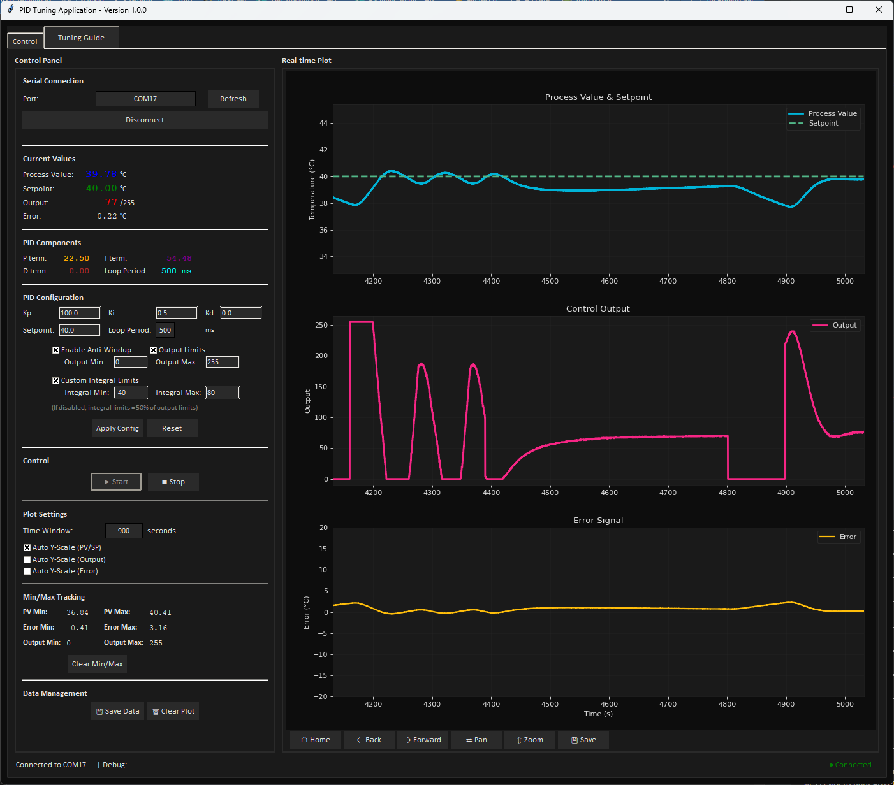

# PID Control Library for Arduino v1.0.0

A comprehensive PID (Proportional-Integral-Derivative) control library for Arduino projects with advanced safety features and tuning capabilities. Python GUI application for real-time tuning with live plots and step response testing!

## PID Tuning App


Run from the PID Tuning App folder using the following command:
```bash
python pid_tuning_app.py
```

Or, run the precompiled version of the application - [get from Releases](https://github.com/PeakeElectronicInnovation/PID_Control/releases/latest)

## Features

### Core PID Control
- **Simple API**: Easy to use with minimal setup required
- **Anti-windup Protection**: Prevents integral term from growing unbounded
- **Output Limiting**: Configurable output limits for PWM control
- **Derivative on Measurement**: Avoids derivative kick on setpoint changes
- **Configurable Sample Time**: Control update frequency
- **Enable/Disable Control**: Turn controller on/off without losing state

### Safety Features (NEW in v1.0.0)
- **Stale Data Detection**: Detects stuck sensors or frozen processes
- **Safe Value Limits**: Ensures process value stays within defined range
- **NaN Detection**: Automatic handling of invalid sensor readings
- **Error State Management**: Automatic controller disable on errors

### PID Tuning Interface (NEW in v1.0.0)
- **PID_Tune Library**: Modular tuning interface for integration
- **Python GUI Application**: Real-time tuning with live plots
- **Step Response Analysis**: Automatic performance metrics
- **Data Export**: CSV export for analysis
- **Configurable Serial Port**: Use any serial port (Serial, Serial1, etc.)

## Installation

### Arduino IDE
1. Download this library as a ZIP file
2. In Arduino IDE, go to Sketch > Include Library > Add .ZIP Library
3. Select the downloaded ZIP file

### PlatformIO
Add to your `platformio.ini`:
```ini
lib_deps = 
    PID_Control
```

## Quick Start

### Basic PID Control
```cpp
#include <PID_Control.h>

// Create PID controller on pin 3 with normal polarity
PID_Control pid(3, true);

void setup() {
    // Initialize with Kp=2.0, Ki=0.5, Kd=0.1, setpoint=25.0
    pid.begin(2.0, 0.5, 0.1, 25.0);
    
    // Optional: Configure safety features
    pid.setStaleDataDetection(0.1, 5000);  // Min rate, max time
    pid.enableStaleDataDetection();
    pid.setSafeValueLimits(0.0, 100.0);
    pid.enableSafeValueLimits();
}

void loop() {
    float input = readSensor(); // Your sensor reading
    pid.update(input);          // The ONLY method you need to call!
    
    // Check for error state
    if (pid.isInErrorState()) {
        // Handle error condition
        handlePIDError();
    }
    
    delay(100);                 // Match sample time
}
```

### With PID Tuning Interface
```cpp
#include <PID_Control.h>
#include <PID_Tune.h>

PID_Control pid(3, true);
PID_Tune tuner(pid);

float readSensor() {
    return analogRead(A0) * 0.1;
}

void setup() {
    pid.begin(2.0, 0.1, 0.05, 25.0);
    
    // Initialize tuning interface
    tuner.begin(Serial, 115200);
    tuner.setSensorCallback(readSensor);
    tuner.enable();
    // Control starts from Python app Start button
}

void loop() {
    tuner.update();  // Handles all communication
    
    if (tuner.isRunning()) {
        pid.update(readSensor());
    }
}
```

## API Reference

### Constructor
```cpp
PID_Control(int out_pin, bool polarity)
```
- `out_pin`: PWM pin for output (use -1 for software only)
- `polarity`: true for normal, false for reverse acting

### Main Methods
```cpp
void begin(float Kp, float Ki, float Kd, float setpoint)
```
Initialize PID controller with tuning parameters and setpoint.

```cpp
void update(float input)
```
Update PID controller with new input value. Call this regularly in main loop.

```cpp
void setpoint(float setpoint)
```
Change the target setpoint.

### Control State
```cpp
void enable()
void disable()
bool isEnabled()
```
Enable or disable the PID controller.

### Tuning Methods
```cpp
void setPID(float Kp, float Ki, float Kd)
```
Update PID tuning parameters.

### Getter Methods
```cpp
float getKp()
float getKi()
float getKd()
float getSetpoint()
float getOutput()
float getProportional()
float getIntegral()
float getDerivative()
float getError()
```
Get current values and PID components.

### Configuration Methods
```cpp
void setOutputLimits(float min, float max)
```
Set output limits (default: 0-255 for PWM).

```cpp
void setIntegralLimits(float min, float max)
```
Set integral term limits for anti-windup.

```cpp
void setSampleTime(unsigned long sample_time)
```
Set minimum time between updates in milliseconds (default: 100ms).

```cpp
void reset()
```
Reset internal state (integral, previous values).

### Safety Features

#### Stale Data Detection
```cpp
void setStaleDataDetection(float minRateOfChange, unsigned long maxTimeMs)
void enableStaleDataDetection()
void disableStaleDataDetection()
```
- Detects when process value isn't changing enough
- Only active when away from setpoint
- Disables controller if data is stale

#### Safe Value Limits
```cpp
void setSafeValueLimits(float minValue, float maxValue)
void enableSafeValueLimits()
void disableSafeValueLimits()
```
- Ensures process value stays within range
- Immediate disable if out of bounds

#### Error State
```cpp
bool isInErrorState()
void clearErrorState()
```
- Check if controller is in error state
- Clear error to resume operation

## PID Tuning Application

The Python PID Tuning App provides real-time tuning capabilities:

### Features
- Real-time parameter adjustment
- Live data plotting (PV, SP, Output, P, I, D terms)
- Step response testing with analysis
- Min/max tracking
- Data export to CSV
- Serial port selection

### Installation
1. Install Python 3.7+
2. Install dependencies: `pip install pyserial matplotlib numpy`
3. Run: `python pid_tuning_app.py`

### Usage
1. Upload companion sketch to Arduino
2. Select serial port and connect
3. Use Start/Stop buttons for control
4. Adjust parameters in real-time
5. Export data for analysis

## Examples

The `examples` folder includes:

### Control Examples
- `PID_Safety_Example`: Demonstrates all safety features
- `PID_Tune_Example`: Shows integration with tuning interface
- `pid_tuning_companion_simple`: Minimal companion sketch

### Tuning Application
- `pid_tuning_app/`: Complete Python tuning application
  - `pid_tuning_app.py`: Main GUI application
  - `pid_tuning_companion/`: Full-featured companion sketch
  - `build_exe.py`: Build executable for Windows

## Usage Tips

### PID Tuning
1. Start with P-only control (Ki=0, Kd=0)
2. Increase Kp until oscillation starts
3. Reduce Kp to 50% of oscillating value
4. Add Ki to eliminate steady-state error
5. Add Kd if needed to reduce overshoot

### Safety Features
1. Always enable appropriate safety features
2. Set stale data thresholds based on process dynamics
3. Use safe value limits for sensor failure protection
4. Handle error states in your code

### Performance
1. Match loop delay to sample time
2. Use appropriate output limits
3. Consider derivative filtering for noisy sensors
4. Monitor integral windup in aggressive tuning

## Theory

The PID controller calculates output as:
```
Output = Kp * error + Ki * integral(error) - Kd * d(input)/dt
```

Where:
- error = setpoint - input
- Integral is accumulated over time
- Derivative is calculated on input (not error) to avoid setpoint spikes

### Safety Features Theory

#### Stale Data Detection
Monitors rate of change when away from setpoint:
- If rate < threshold for too long → error
- Resets when at setpoint or sufficient change
- Protects against stuck sensors

#### Safe Value Limits
Hard limits on process value:
- Immediate error if out of bounds
- Protects against extreme conditions
- Useful for sensor failure detection

## Version History

### v1.0.0 (Current)
- Added comprehensive safety features
- Added PID_Tune library for modular tuning
- Added Python GUI tuning application
- Added step response analysis
- Added configurable serial ports
- Improved documentation and examples

### v0.9.0
- Initial release
- Basic PID control
- Anti-windup protection
- Output limiting

## License

This library is open source under the MIT license. Feel free to use and modify for your projects.

## Support

For issues, questions, or contributions:
- Check the examples folder for usage patterns
- Review the API documentation
- Test with the PID Tuning Application
- Report issues on GitHub
